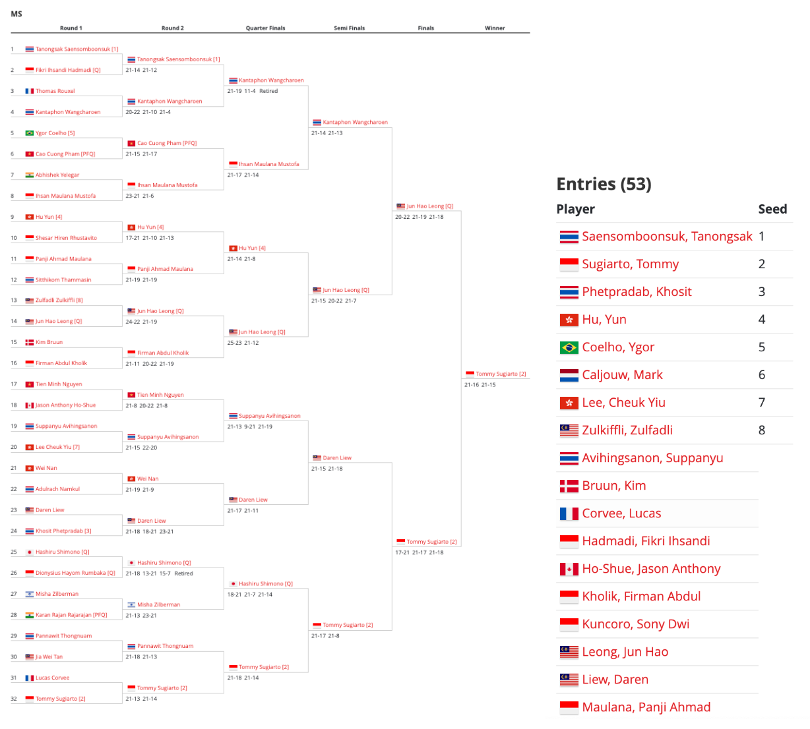

```{r setup, include=FALSE}
knitr::opts_chunk$set(echo = TRUE, warning = FALSE)
```

```{r libraries, include = FALSE}
library(tidyverse)
library(ggplot2)
library(stringr)
library(lubridate)
```

# Section 1 - Introduction

## 1.1 - Motivating Questions and Scope of Analysis 

Badminton, a sport originating in Ancient Greece, China, and India that has grown from merely a children’s game to the Olympic-recognized sport that it is today, has millions of players and fans across the globe. After badminton entered the Olympics as a sport in 1993, tournaments around the world sprung up to determine player qualifications for badminton participation in the Olympics. One of the main international governing bodies for such tournaments is the Badminton World Federation, who hosts the HSBC BWF World Tour. Such a large event brings together players from all different backgrounds, playing styles, trainings, etc. Ultimately, there’s one team that wins a badminton match and, of course, one winner per event in the tournament, which leads us to ask: **what factors could contribute to winning a badminton match?** 

To explore such a question, we’ll be analyzing only the Men’s Singles events in BWF’s HSBC World Tour from 2018 to 2021 and further exploring how factors like set-win advantage, home-court advantage, and number of consecutive points per match all affect a team/player’s win rate. Since we’ll only be exploring one event, we’re not stating that the same relationships between our explored factors and win rate will apply to other events like Women’s Singles, Mixed Doubles, etc. There are also other considerable factors that contribute to a player or team winning a match that are not present in our scraped data set like age, height, how long a player has trained for, etc. Additional exploration of trends in those events are needed to cross-reference their results with the results we’ll gather from the Men’s Singles event. 

## 1.2 - Background on Badminton

_Basic Scoring System:_
A game of badminton is played as a best-of-three match. The first team to win two sets will be considered the winner of the match. Each set is played until one team reaches 21 points. If the score is 20-20, the set is played with deuce rules meaning that one team must win by two points to be considered the winner of the set. This rule follows up until when the score is 29-29, then the set is sudden death and the next team to score a point will win the set 30-29. 

_Events:_
There are 5 events that are typically played in a badminton tournament. These events are Men’s Singles, Women’s Singles, Men's Doubles, Women’s Doubles, and Mixed Doubles. In Men's and Women's singles, one person will play against another person of the same sex. In Men’s and Women’s doubles. Two people of the same sex will play against a pair of people that are the same sex as them. Lastly, in Mixed Doubles, two teams consisting of one man and one woman on each team will play one another. 


_How to qualify for certain tournaments:_
To qualify for tournaments in general, ranging from tournaments hosted by the BWF to the Olympics, players must qualify for the tournament before competing. Lower, entry-level tournaments don’t require strict qualifications, but higher level tournaments like BWF tournaments and the Olympics require ranking qualifications. To increase a player’s ranking, players must compete in a variety of tournaments. Some tournaments give you points just by entering and competing in the tournament no matter if you win or lose. However, players receive more points if they win a match in a tournament. These points that players earn determine that player’s ranking, and higher level tournaments require players to be above a certain ranking in their qualifying tournaments to compete.
 
_How the tournament brackets work:_
Like other sports with tournament brackets, badminton tournament brackets work in similar ways. Below is an example tournament bracket from the BWF PRINCESS SIRIVANNAVARI Thailand Masters 2018 Tournament in the Men’s Singles Event along with the rankings of each player:


Comparing the two, Seed (another word for rank) 1 player Saensombooksuk was placed at the top of the bracket, whereas Seed 2 player Sugiarto was placed at the bottom. The tournament organizers did so to avoid eliminating one of the top two players in their tournament in Round 1. The rest of the top 8 Seeds are spread throughout the bracket and do not play against each other in Round 1. In other words, the bracket for the beginning round in tournaments is determined by the player’s ranking, and seeded players won’t play against each other unless an extremely small number of players are participating in that event for the tournament. 

_Where did our data come from?:_
Our data was obtained through kaggle.com, which is a website that houses many data sets for data scientists and machine learning enthusiasts. The data set that we used was collected from the official BWF website using Python. 

## 1.3 - Variable Explanation and Univariate Plots

### Explanatory Variables
1. Ranking (team_one_rankings/team_two_rankings, int): A quantitative variable that states a Men's Singles player's ranking according to the BWF Historical Rankings dataset we downloaded from Kaggle. The range of players' rankings goes from rank 1 to rank 2000. Rankings would have no notable extreme values besides rank 1 being noted as more experienced, and rank 2000 being noted as the least experienced of all the 2000 players in our dataset. 


2. End Scores, separated by set (game_1_score/game_2_score/game_3_score, char):The final score of each game. This is formatted with the score of player 1, followed by a single hyphen, and then the score of player 2 ([player 1] - [player 2], EX. 12 - 21). An extreme point difference would occur if a player is leading by more than 8 points.

3. Country (country, char): the country that the tournament was played in (Ex. Thailand, Malaysia, Indonesia, India. etc). No extreme values.

4. Nationality (team_one_nationalities/team_two_nationalities, char): The nationality of each player according to a 3-letter nationality code/abbreviation. No extreme values.

# Section 2 - Player Ranking vs. Win Rate

We'll begin by exploring how a player's ranking affects their chances of winning a badminton match. A player's ranking is most often used to classify their skill level -- the higher the ranking, the better the player is how we as viewers generally see ranking. However, we're interested in testing to see if that's true in our dataset and further exploring if increasing the difference in ranks between two players also simultaneously increasing the win rate of the higher-ranked player. So, our overall question for Section 2 is: **How does a player's rank affect their chance of win?** To do so, we'll need to import a dataset of player rankings outside of our existing dataset from BWF to compare win rated with that player's ranking. 

## 2.1 Loading & Cleaning our Data

First, we rmust ead in our first CSV file and change all our player names to lower-case for easier data analysis and comparison. This will be useful when we join our second data set with all lower case names. Next, we need to change the formatting of the date using 'lubridate' so that it matches with our second data set. 

```{r Reading in  Data/Lowercased Names}
# Read in the Men's Singles data set and add two columns for the lowercase names of the 
# two teams.

men <- read.csv('ms.csv')

men_team_one_lower <- tolower(men$team_one_players)


men_team_two_lower <- tolower(men$team_two_players)

men <- cbind(men, men_team_one_lower)
men <- cbind(men, men_team_two_lower)

# Use 'lubridate' to make the date into year/month/day. 

men$date <- dmy(men$date)
men<- tibble(men)
men
```

The next code chunks show how we're loading in the second data set with the players and their ranking for each week from 2018 to 2021. The dates were previously listed as column names, but we reorganized the data set so the dates would be values under the new column "Date." The values under the dates columns are moved to a new column named "rank." Since our players' first and last names were separated into two columns, we combined the two columns so that just one column would represent the player's full name.
```{r Reading in Ranking CSV }
# Read in the player ranking data.

ranking <- read.csv('historical_bwf_ranking.csv')

# Change all the 'week' columns into rows, so each player has many rows for each 
# week/ranking pair. 

new_ranking <- ranking%>%
  pivot_longer(cols= starts_with("X"), names_to = "dates", values_to = "rank", 
               values_drop_na= TRUE) %>% 
    mutate(name = paste(First.name, Last.name, sep = " ")) %>% 
  select(-First.name, -Last.name)

# Reorder the 'new_ranking' columns to make it more readable.

new_ranking <- new_ranking[, c(1,4,2,3)]
head(new_ranking)
```

To make the data set more comprehensible, we rearranged the column order of the data set. 

```{r Organizing Ranking}
# Organize columns to make data set more readable by mainly changing the 'date' 
# format. 

new_ranking_org <- new_ranking %>% 
  mutate(date = ymd(str_sub(dates, 2))) %>% 
  filter(date >= ymd("2018-01-01")) 

new_ranking_org <- new_ranking_org[, c(1,5,2,4)]
head(new_ranking_org)
```

The following 5 code chunks are used to join our rankings table to our Men's Singles table. We suggest not running the code as it will take a long time and simply using the new data frame we created called 'men_with_rankings' instead, hence why we have 'eval = FALSE' for the following 5 code chunks.


```{r Find Rank Function, eval = FALSE}
# 'The find_rank' function is used to find the rank of a player at a given time  
# and date.

find_rank <- function(date_given, player) 
{
  new_ranking_org <- new_ranking_org %>% 
    filter(name == player) %>% 
    filter(date <= date_given)
  last_row <- tail(new_ranking_org, n = 1)
  if(dim(last_row)[1] == 0)
  {
    return(NA)
  }
  else
  {
    return(last_row$rank)
  }
}
```


```{r Ranking for Team 1, eval = FALSE}   
# Finding rankings for Team One

player_one_ranking <- c()
for(i in 1:3761)
{
  player_one_ranking <- append(player_one_ranking, find_rank(ymd(men$date[i]),
                                                    men$men_team_one_lower[i]))
}
```


```{r Ranking for Team 2 ,eval = FALSE}
# Finding rankings for Team Two

player_two_ranking <- c()
for(i in 1:3761)
{
  player_two_ranking <- append(player_two_ranking, find_rank(ymd(men$date[i]), 
                                                  men$men_team_two_lower[i]))
}
```


```{r Outputs New Ranking CSV, eval = FALSE}

# Organizing 'men_with_ranking' data frame

men_with_ranking <- cbind(men, player_one_ranking, player_two_ranking)
men_with_ranking <- men_with_ranking %>% 
  select(-men_team_one_lower, -men_team_two_lower)

colnames(men_with_ranking)[39] = "team_one_rankings"
colnames(men_with_ranking)[40] = "team_two_rankings"

men_with_ranking <- men_with_ranking[, c(1:17,39,40,18:38)]
men_with_ranking

# Our new data frame with our men's singles data set joined with the 
# player's ranking. 

write.csv(men_with_ranking,"men_with_rankings.csv", row.names = FALSE)
```


```{r Reading in Data}
## Continuing to clean our 'retired' column data. 

men_with_rankings<- read.csv('men_with_rankings.csv') 
clean_men <- men_with_rankings %>%
  filter(retired == "FALSE") %>% 
  select(-tournament_type, -discipline, -game_1_scores, -game_2_scores,
         -game_3_scores)
```

We also want to remove all rankings with an NA value.

```{r No NA Rankings}
clean_men2 <- clean_men %>% 
  filter(!is.na(team_one_rankings) & !is.na(team_two_rankings))
clean_men2 <- tibble(clean_men2)

head(clean_men2)
```

## 2.2 - Data Analysis

Now that our data sets and CSV files are cleaned and have our needed information, we can begin analyzing our data. 

The question we're analyzing in Section 2 is: **What is the probability that the team ranked higher will win any given match?**. Basically, we're trying to see if player/team ranking has any correlation with the chances of a team or player winning the match overall. 

```{r Determining if Team 1 won and is higher, results='hide'}

## Filtering for matches where Team 1 won
team_one_wins <- clean_men2 %>% 
  filter(winner == 1)

# If the higher ranking team wins, set ranking_matters as '1'.
# If the higher ranking team loses, set ranking_matters as '0'.
team_one_wins$ranking_matters = 
  ifelse(team_one_wins$team_one_rankings < team_one_wins$team_two_rankings, 
         print('1'),
      ifelse(team_one_wins$team_one_rankings > team_one_wins$team_two_rankings,
               print('0'), print(NA)))
```

The problem with the data set is that values under 'ranking_matters' is saved as a string, not a numeric value. So, we will change our data type of our 'ranking_matters' column from characters to numeric values because with the values of the column being just 0 and 1, we're able to take the mean of the entire column. We know that the closer that value is to 1, the more the statement that a higher ranked team is more likely to win is further supported. 

```{r, Character to Nummeric Ranking}
## Transform our 'ranking_matters" column from string to numeric.

team_one_wins_clean <- team_one_wins %>% 
  select(team_one_rankings, team_two_rankings, ranking_matters) %>% 
  transform(ranking_matters = as.numeric(ranking_matters))

## Exclude any NA values in our 'ranking_matters' column.

better_one <- team_one_wins_clean %>% 
  filter(ranking_matters %in% c(0,1))
head(better_one)

```

The code below shows the probability that  66.8% of all Team 1 winners ranked higher than Team 2. 

```{r Probability Finder}
## Returns that the higher ranked player won 66.756% of the time when Team 1 
# won

 higher_win_prob <- mean(better_one$ranking_matters, na.rm = "FALSE")
 higher_win_prob
```

Now that we've evaluated the probability of Team 1 winning with a higher ranking compared to Team 2, we need to do the same thing for Team 2 winners with a higher ranking compared to Team 1 for a conclusive result. 

```{r Determining if Team 2 wins and is higher, results='hide'}
## Same idea as our code chunk named 'Determining if Team 1 won and is higher'
team_two_wins <- clean_men2 %>% 
  filter(winner == 2)


team_two_wins$ranking_matters = ifelse(team_two_wins$team_one_rankings > 
                                    team_two_wins$team_two_rankings, print('1'),
      ifelse(team_two_wins$team_one_rankings < team_two_wins$team_two_rankings, 
             print('0'), print(NA)))

## Note: The number '1' means that the higher-ranked team won. 

team_two_wins_clean <- team_two_wins %>% 
  select(team_one_rankings, team_two_rankings, ranking_matters) %>% 
  transform(ranking_matters = as.numeric(ranking_matters))

better_two <- team_two_wins_clean %>% 
  filter(ranking_matters %in% c(0,1))

head(better_two)
```

We now have two tables with data of Team 1 or Team 2 winning with each team's ranks. Both tables have a 1 if the higher-ranked player won and a 0 if the lower-ranked player won. We can combine these tables and take the mean of the 'ranking_matters' column.

The result is the probability that the higher-ranked player will win a match based on the Men's Single data. 

```{r Combining Two Columns}
# Combine the two tables where '1' means the higher-ranked team won.

combined_one_two <- better_one %>% rbind(better_two)
mean(combined_one_two$ranking_matters)

# Take the means of both Team 1 ranked higher winning and Team 2 ranked higher
# winning

# The resulting probability is 0.6726828. 

# 0 represents losses and 1 represents wins
temp <- as.factor(combined_one_two$ranking_matters)
levels(temp) <- c("Loss", "Win")

ggplot(combined_one_two, aes(x = temp)) + geom_bar() +
  labs(x="Win or Loss", y="Count", title="Did The Higher-Ranked Player Win?") + 
  geom_text(aes(label = after_stat(count)), 
            stat = "count", vjust = 1.5, colour = "white")
  
```

The results show that 67.3% of players ranked higher than their opponent won their match. Now we must check to see if our prediction of 67.3% of players ranked higher winning their match is purely by chance or if it may apply to any scenario. To do so, we'll be performing a t-test:

```{r T-Test for Rankings}
# Perform a t-test to see if ranking matters.
# If ranking doesn't matter, we expect the mean to be 0.5, where both sides 
# have equal chance of winning. 
t.test(combined_one_two$ranking_matters, alternative="greater", mu=0.5)
```

Because of the low p-value of less than 0.01, we can reject our null hypothesis that ranking has no effect on who wins the overall game. There is convincing evidence that the team with the higher rank will win games more frequently.

## 2.3 - Additional Analysis: Rank Gap vs. Win Rate

To observe the impact of varying gaps between the players' rankings on their win percentages, we analyzed the win percentage of the players who won in matches that had ranking gaps of at least some certain value. The values selected were the values from 10 to 200 with increments of 5 (10, 15, 20, ..., 195, 200).

```{r Function for Finding Higher Ranked Wins}
## Function for getting # of games in which the higher ranked team wins with 
## a ranking gap of at least (value)
games_won_gap <- function(data, value) {
  result <- data %>%
  filter(abs(team_one_rankings - team_two_rankings) >= value) %>%
  mutate(higher_ranked = 
           ifelse(team_one_rankings < team_two_rankings, 1, 2)) %>% 
    filter(winner == higher_ranked) %>%
    nrow()
    
  return(result)
}
```


```{r Function For Finding Ranking Gap Games}
## Function for getting # of games in which there is a ranking difference of 
## at least (value) between the two playing teams
games_given_app <- function(data, value){
  result <- data %>%
  filter(abs(team_one_rankings - team_two_rankings) >= value) %>%
    nrow()
  
  return(result)
}
```


```{r Function Win Percentage with Higher Rankings}
# Function that returns the win percentage of the teams that had higher
# rankings than their opponents given that there is a difference in rankings
# of at least (value)
win_percentage_given_ranking_difference <- function(data, value){
  return(games_won_gap(data,value)/
                 games_given_app(data,value))
}
```


```{r Get Win Percentage with Ranking Gaps}
# Get the win percentage of the players whose rankings were greater than their
# Opponent's by at least a certain value from 10 to 400 in increments of 5.
# Plot the win percentage vs the ranking gap
ranking_gaps <- seq(10, 400, 5)
win_percentages_ranking_diff <- c()
for(i in ranking_gaps){
  win_percentages_ranking_diff <- append(win_percentages_ranking_diff, 
                                        win_percentage_given_ranking_difference
                                         (clean_men, i))
}
ranking_diff_wins <- data.frame(ranking_gaps, win_percentages_ranking_diff)
ggplot(ranking_diff_wins, aes(x = ranking_gaps, y = 
                                      win_percentages_ranking_diff)) + 
        geom_point() + geom_line() + 
        xlab("Difference in Rankings") + 
        ylab("Winning Percentage of Team with Higher Ranking") + 
labs(title = "Percentage of Wins for Teams with Higher Rankings by Rank Range")
```

```{r Get Win Percentage with Ranking Gaps2}
# Get the win percentage of the players whose rankings were greater than their
# Opponent's by at least a certain value from 10 to 400 in increments of 5.
# Plot the win percentage vs the ranking gap
ranking_gaps <- seq(10, 200, 5)
win_percentages_ranking_diff <- c()
for(i in ranking_gaps){
  win_percentages_ranking_diff <- append(win_percentages_ranking_diff, 
                                        win_percentage_given_ranking_difference
                                         (clean_men, i))
}
ranking_diff_wins <- data.frame(ranking_gaps, win_percentages_ranking_diff)
ggplot(ranking_diff_wins, aes(x = ranking_gaps, y = 
                                      win_percentages_ranking_diff)) + 
        geom_point() + geom_line() + 
        xlab("Difference in Rankings") + 
        ylab("Winning Percentage of Team with Higher Ranking") + 
labs(title = "Percentage of Wins for Teams with Higher Rankings by Rank Range
     from 0 to 200")
```

What our graphs above show is that, as the rank gap between teams increases from 10 to around a 200 rank gap, the chances of the higher-ranked team winning increases as well. This supports our overall hypothesis that the higher-ranked team wins more often than the lower-ranked team. 

We can see that although the graph follows what appears to be an exponential trend from 10 to 200, there is an unusual growth/discrepancy in win percentage when the difference in rankings is around 10 to 30 before dipping back down. We believe that this is due to the uncertainty that comes with having matches that involve two players of very similar rankings. Because it is difficult to tell who has a higher chance of winning given such similar rankings, when the data includes the matches with low ranking differences, it fluctuates more; thus, resulting in the unusual hump in the graph.

At a ranking difference of around 200 to 350, the winning percentage dips down. One explanation for this is that there are fewer data points satisfying this ranking gap, making the data more prone to outliers. Another possible reason is that top players tend to play other top players, so a difference of between 200 ranking points would probably represent two players not within the top 200 players playing one another. With two low rated players, there is a possibility that one of the players is new, and as such their ranking isn't a true reflection of their skills (ie. they can beat a much higher rated player) This could explain the dip in winning percentage between 200 and 350.

After the graph passes 400, it starts to grow again since the ranking gap is significant enough to show a skill difference.

```{r Models}
exp_model <- lm(log(win_percentages_ranking_diff) ~ ranking_gaps, data = ranking_diff_wins)
summary(exp_model)
```


Our group hypothesized that as the ranking gaps between teams increased the win rate of the higher ranked teams would also increase. In our original plot the ranking difference that we explored went from 10 to 400 but the reason why our exponential regression model only explores 10 to 200 is because we found that the interval from 10 to 200 is more relevant. Due to tournament restrictions, its not likely that a player ranked 400 more than another would be playing each other. The top players would be versing around their rank. The exponential regression model shows that the r squared value is 0.9 which is very close to the value 1. The closer the r^2 value is to 1, the more the model fits the plots. Since the r^2 model is 0.9 it means that the factor of ranking gap is significant enough to say that the relationship between rank gap and win rate grows exponentially. 

## 2.4 - One Proportion Z-Test for Randomness

We also want to perform a one proportion z-test to ensure that our results from our analysis didn't solely occur by chance because of the data set we chose to analyze, but rather that these results could occur with any other data set we chose. To do this, we chose to compare the results we obtained with games that included matches between players of ranking differences of at least 10 and at least 200. The result of this z-test would show whether or not increasing this ranking gap has an effect on the winning percentage of the higher-ranked player

```{r}
p10 <- win_percentage_given_ranking_difference(clean_men, 10)
prop.test(games_won_gap(clean_men, 200), 
          games_given_app(clean_men, 200), p=p10, 
          alternative = "greater", correct=TRUE)
```

As we can see from the results of our z-tests, the low p-value of less than 0.05 shows that we are able to reject our null hypothesis that greater ranking gaps have no effect on winning percentage of the higher ranking team. There is convincing evidence that greater gaps in ranking give the higher ranked team a greater probability of winning.

# Section 3 -  1st Set Win to Overall Match Win vs. 2nd Set Win to Overall Match Win

Now, we'll explore the probability of a team winning the third set after having won either the first or second set of a match. We want to see if there's a higher chance of a team winning the third set if they won the first set, or if they have a higher chance of winning the third set if they won the second set. It'll be interesting to see if winning consecutive sets is more common than winning alternate sets, and if players should have high hopes of making it to a third set in they lost first or second set. So, our overall question for this section is: **For all matches that make it to the third set, what is the probability that the team that won the first set wins?**

## 3.1 - Cleaning our Data

First, we need to filter for only the games that have teams that made it to the third set, aka matches with three sets. We also don't want to analyze any games where a team retired in the middle of the game since we don't consider people leaving a match mid-way through a true win for the other team.

Next, we will split the scores of each game into two individual point scores, winning and losing, in order to compare them. We separate the given connected game scores by indicating that the scores will be split by the character "-".

```{r Score Split}
# Split the given scores by the character '-'.

match_winner_men <- clean_men2 %>%
  filter(nb_sets == 3, retired == "FALSE") %>% 
  select(9:11, winner)


g1_split <- str_split(match_winner_men$game_1_score, "-")
g2_split <- str_split(match_winner_men$game_2_score, "-")

g1_split[1:10]
g2_split[1:10]

head(match_winner_men)

```

We then make a column that displays which team won each game since the original data set only told us who won each game overall. 

The score on the left of the '-' character represents Team One and to the right of the '-' character represents Team Two. If the scores were to be subtracted, a positive result means that Team One won and a negative result would mean Team Two won.

```{r Winner Finder Of Sets}
g1_diff <- rep(NA, 1157)
g2_diff <- rep(NA, 1157)

# Subtract the scores of Team One vs. Team Two. 

for(i in 1:1157){
  g1_diff[i] <- as.numeric(g1_split[[i]][1]) - as.numeric(g1_split[[i]][2])
  g2_diff[i] <- as.numeric(g2_split[[i]][1]) - as.numeric(g2_split[[i]][2])
}
head(cbind(match_winner_men, g1_diff, g2_diff))

# Identify the result from the subtraction to see if Team One or Team Two won.

fixed_match_winner_men <- match_winner_men %>% 
  mutate(game_1_winner = ifelse(g1_diff < 0, 2, 1),
         game_2_winner = ifelse (g2_diff < 0, 2, 1))

head(fixed_match_winner_men)

# Note = Column 'winner' describes Set/Game 3's winner. 
```

## 3.2 - Data Analysis

Now, we can check how many times the winner of the first game was also the winner of the third game. We do the same comparison with how many times the winner of the second game also won the third game. 

```{r Set Winner meets Match Winner}
fixed_match_winner_men %>% 
  filter(winner == game_1_winner) %>% 
  nrow()

fixed_match_winner_men %>% 
  filter(winner == game_2_winner) %>% 
  nrow()

p <- fixed_match_winner_men %>% 
  mutate(set_won_and_winner = ifelse(winner == game_1_winner, 
                                     "Won first set and won match", 
                                     "Won second set and won match")) %>% 
  ggplot(aes(x = set_won_and_winner))+
  geom_bar()+
  labs(x = "Set Won", y = "Count", title = "Set Won Matches the Match Winner")

p

#Note: Total is 1157.

526/1157

631/1157
```

Our results showed that that the winner of the first game was also the winner of the third game for 526 matches This means that, if you win the first set, 45.5% of the time, you win the third game, aka the whole match, if the game goes to 3 sets. Consequently, if you lose the first set but win the second set, 54.5% of the time, you win the third game, therefore winning the entire match, if the game goes to 3 sets. 

## 3.3 - Additional Analysis: Chance of Consecutive Set Wins

We also want to find the probability of winning a match by winning consecutive sets/games. 

```{r Probability of Winning 2 Sets In a Row}
won_1_won_2 <- clean_men %>%
  filter(nb_sets == 2) %>%
  nrow()

total_matches <- clean_men %>% nrow()

#Returns '2113'

won_1_won_2/total_matches
```

Our results 64.6% of the time if a team the first set, they won the second set 64.6% of the time. 

# Section 4 - Homecourt Advantage vs. Win Rate

Our last section of analysis that we'll perform on our data is seeing if having a home court advantage will increase the chances of a team winning. We can tell if a team is on their home court by comparing their nationality to the location of the tournament they're playing at. When playing badminton, teams tend to have an advantage on their home court if they understand which side of the court is better to start on, what court is the best to play on, lighting differences in a tournament center, and much more. So, our overall question that we'll be exploring in Section 4 is: **Does homecourt advantage increase the chances of a team winning, based on the team's nationality?** 

## 4.1 - Cleaning our Data & Sourcing Outside Information

First, we need to source our country code from an outside source to match our tournament location with our team's nationality. We do so by pulling country code data from Wikipedia. We cross-referenced the country code from Wikipedia with the official country codes per country to ensure that the codes we're sourcing from Wikipedia are accurate. 


```{r Reading in Country Codes}
homecourt <- clean_men[,c(1:15)]

## Read Wikipedia data on country codes into our file.
## Format the country code into 3 letters to match our 'nationality' values. 

country_codes <- read.csv("wikipedia-iso-country-codes.csv")
country_codes <- country_codes %>% 
  select(English.short.name.lower.case, Alpha.3.code)

## Join our new Wikipedia dataset with our existing dataset with tournament
## location country codes. 

homecourt <- homecourt %>% 
  left_join(country_codes, by = c("country" = "English.short.name.lower.case"))
colnames(homecourt)[16] = "tournament_country"

homecourt <- tibble(homecourt)
head(homecourt)

```

## 4.2 - Data Analysis

Now that our needed information is in our data frame, we can perform our data analysis. We want to make sure that the nationalities of our two teams are not the same, because there would be no need to compare homecourt advantage since it's either they both have an advantage or both are at a disadvantage. We then want to see if either team's nationality matches the tournament location, because if neither team's nationality matches the location, homecourt advantage is not relevant. 

```{r Countries with Homecourt Advantage}
## Filter for matches that have a possibility of homecourt advantage with 
## the above noted features. 

homecourt2 <- homecourt %>% 
  filter(team_one_nationalities != team_two_nationalities,
  team_one_nationalities == tournament_country | team_two_nationalities == 
                                                      tournament_country) 

## Count the number of homecourt matches we have in our dataset. 

number_of_homecourt_games <- homecourt2 %>% 
  group_by(tournament_country) %>% 
  count()

## Identify which matches had someone of the same nationality as the 
## tournament's location, win -- thus solidifying our hypothesis of 
## there being homecourt advantage. 

homecourt_with_winners <- homecourt2 %>% 
  mutate(winner_country = ifelse(winner == 1, team_one_nationalities,
                                 team_two_nationalities)) %>% 
  filter(winner_country == tournament_country) %>% 
  select(-winner_country)

number_of_homecourt_victories <- homecourt_with_winners %>% 
  group_by(tournament_country) %>% 
  count()

summed_homecourt <- number_of_homecourt_games %>% 
  left_join(number_of_homecourt_victories, by = "tournament_country")

summed_homecourt[is.na(summed_homecourt)] = 0

summed_homecourt<- summed_homecourt %>% 
   mutate(win_ratio_inside = n.x / (n.y + n.x))
 
colnames(summed_homecourt)[2] = "total_wins_inside"
colnames(summed_homecourt)[3] = "total_losses_inside"
```


```{r Graph of Each Country Win Loss}

#Find how many wins/losses each player has outside of their home country for 
#both teams 

homecourt <- homecourt %>%
  filter(team_one_nationalities != team_two_nationalities)

team_1_wins_outside <- homecourt %>% 
  mutate(player_outside_1 = ifelse(team_one_nationalities != tournament_country 
                                   & winner == 1, team_one_nationalities, 
                                   paste("losses for", team_one_nationalities, 
                                         sep = " ")))%>% 
  group_by(player_outside_1) %>% 
  count()

country_wins_outside1 <- team_1_wins_outside[c(1:26,93:111),]
country_losses_outside1 <- team_1_wins_outside[27:92,]

team_2_wins_outside <-  homecourt %>% 
  mutate(player_outside_2 = ifelse(team_two_nationalities != tournament_country 
                                   & winner == 2, team_two_nationalities, 
                                   paste("losses for", team_two_nationalities, 
                                         sep = " "))) %>% 
  group_by(player_outside_2) %>% 
  count()

country_wins_outside2 <- team_2_wins_outside[c(1:26,89:106),]
country_losses_outside2 <- team_2_wins_outside[27:88,]

#join the two teams' wins and losses together, then calculate total wins 
#and losses
country_wins_outside <- country_wins_outside1 %>% 
  full_join(country_wins_outside2, 
            by = c("player_outside_1" = "player_outside_2"))

country_wins_outside[is.na(country_wins_outside)] = 0

country_losses_outside <- country_losses_outside1 %>% 
  full_join(country_losses_outside2, 
            by = c("player_outside_1" = "player_outside_2"))

country_losses_outside[is.na(country_losses_outside)] = 0

country_wins_outside <- country_wins_outside %>% 
  mutate(total_wins_outside = n.x + n.y) %>% 
  select(-n.x,-n.y) %>% 
  arrange(player_outside_1)
colnames(country_wins_outside)[1] = "Country"

country_losses_outside <- country_losses_outside %>% 
  mutate(total_losses_outside = n.x + n.y) %>% 
  select(-n.x,-n.y) %>% 
  arrange(player_outside_1)


country_losses_outside <- country_losses_outside %>% 
  mutate(Country = str_sub(player_outside_1,12)) 

country_win_loss_outside <- country_wins_outside %>% 
  full_join(country_losses_outside, by = c("Country" = "Country")) %>% 
  arrange(Country) %>% 
  select(-player_outside_1)

country_win_loss_outside[is.na(country_win_loss_outside)] = 0

#calculate win ratio as wins / total
country_win_loss_outside <- country_win_loss_outside %>% 
  mutate(win_ratio_outside = total_wins_outside / 
           (total_wins_outside + total_losses_outside))

country_homecourt_analysis <- summed_homecourt %>% 
  left_join(country_win_loss_outside, by = c("tournament_country" = "Country"))

#each country with wins outside and losses outside
country_homecourt_analysis

country_homecourt_analysis2 <- country_homecourt_analysis[,c(1,4,7)]

country_homecourt_analysis2 <- country_homecourt_analysis2 %>% 
  pivot_longer(2:3, names_to = "in_or_out", values_to = "ratio")

ggplot(country_homecourt_analysis2, 
       aes(x = tournament_country, y = ratio, fill = in_or_out)) + 
  geom_col(position = "dodge") + 
  theme(axis.text.x = element_text(angle = 90, hjust = 1, vjust = 0)) + 
  labs(x = "Country", y = "Win Ratio", 
       title = "Win Ratio Inside and Outside of Country")
```

We can now tell from the side-by-side bar chart above that, for every country, our players’ win rates in their home country were higher than their win rates outside of their home country, therefore confirming our hypothesis that home court advantage plays a role in increasing the match win rate. Some outliers in the graph include England, which has a win-ratio inside the country of 1 and Scotland, which has a win ratio outside of 0. These outliers could be caused by not having enough data points due to the restrictions we applied to the data, such as nationalities between the two teams can't be the same.

We explored why some players might be performing better in their home country compared to when they are playing outside. Based on an OHSU study on the NBA Bubble where players were isolated within one area, high-scoring contests during a three-month period were much more common. As a group we had predicted that the reason why homecourt advantage may have came to effect was because players would be hearing the cheers and support from their fans, but in reality it could most likely be due to the effects of jet-lag and an irregular sleep schedule for outside opponents. 


# Section 5 - Univariate Plots

We thought it would be interesting to explore the distribution of losing scores across all matches in univariate for a high-level analysis. Here, we created three data frames that narrowed each game down to its score: each value is formatted with the score of Team 1, followed by a single hyphen, and then the score of Team 1 ([Team 1] - [Team 2], EX. 12 - 21). Each data frame was manipulated so that the game score of each specific value is a numeric value rather than a character, and we also included a new column that indicated the losing score of that specific game. Then, we combined the data frames into a single data frame, so that we could analyze the losing scores of all games, regardless of whether it was game 1, game 2, or game 3.

## 5.1 - Losing Scores for 1 Game

```{r Losing Scores for 3 sets }
g1_scores_split <- data.frame(match_winner_men$game_1_score)

g2_scores_split <- data.frame(match_winner_men$game_2_score)

g3_scores_split <- data.frame(match_winner_men$game_3_score)

# Create a data frame with the three data frames derived from the 
# three game columns.

g1_score_split <- g1_scores_split %>% 
        separate(match_winner_men.game_1_score, c("g1_score1","g1_score2")) %>% 
        transform(g1_score1 = as.numeric(g1_score1), 
                  g1_score2 = as.numeric(g1_score2)) %>% 
        mutate(g1_losing_score = ifelse(g1_score1 > g1_score2, g1_score2,
                                        g1_score1)) %>% 
select(3)

head(g1_score_split)

g2_score_split <- g2_scores_split %>% 
        separate(match_winner_men.game_2_score, c("g2_score1", "g2_score2")) %>% 
        transform(g2_score1 = as.numeric(g2_score1), 
                g2_score2 = as.numeric(g2_score2)) %>% 
        mutate(g2_losing_score = ifelse(g2_score1 > g2_score2, g2_score2,
                                        g2_score1)) %>% 
        select(3)

head(g2_score_split)

g3_score_split <- g3_scores_split %>% 
        separate(match_winner_men.game_3_score, c("g3_score1", "g3_score2")) %>% 
        transform(g3_score1 = as.numeric(g3_score1), 
                        g3_score2 = as.numeric(g3_score2)) %>% 
        mutate(g3_losing_score = ifelse(g3_score1 > g3_score2, g3_score2, 
                                        g3_score1)) %>% 
        select(3)

head(g3_score_split)

all_losing_scores <- tibble(losing_scores = c(g1_score_split$g1_losing_score,
                                                g2_score_split$g2_losing_score,
                                                g3_score_split$g3_losing_score))

all_losing_scores %>% 
 summarize(mean_losing_scores = mean(losing_scores, na.rm = TRUE), 
           median_losing_scores = median(losing_scores, na.rm = TRUE))

all_losing_scores <- all_losing_scores %>% 
        group_by(losing_scores) %>% 
        summarize(count = n())

all_losing_scores

all_losing_scores_plot <- all_losing_scores %>% 
        ggplot(aes(x = losing_scores, y = count)) + geom_col()+
        geom_text(aes(label = count), size = 2.7, vjust = -1) +
        labs(title = "Distribution of Losing Scores For Three-Set Games") + 
        scale_x_continuous(n.breaks = 20) + 
        xlab("Points by the Losing Player") +
        ylab("Count")

all_losing_scores_plot
```

This bar chart depicts the frequency of losing scores, whose specific value is located above each bar, for our dataset. The losing scores ranged from a minimum of 4 to a maximum of 29. It is roughly symmetrical with a similar mean and median: the data has a mean of 15.99642 and a median of 16. We can also take into account possible outliers, such as the far right tail. (Regarding the right tail, it is unlikely that players score over 24 points for a single game, as demonstrated through the graph. The reason for this could be attributed to the fact that in most cases, the player that reaches 21 points first will win, preventing the losing player from accumulating more than 21 points.)

## 5.2 - Losing Scores for 2 Games

As badminton matches are played with best out of three games (also known as sets), some matches only reach two games. That being said, we were curious about whether the distribution of losing scores would differ for two game matches. We used a similar approach as we did for analyzing the overall losing scores; but instead, this time we mutated and combined data frames for game 1 and game 2, filtering out matches that had three games/sets. `

```{r Losing Scores for 2 Games}
match_winner_men_2s <- clean_men %>%
        filter(nb_sets == 2, (retired == "FALSE" | retired == "FALSE")) %>% 
        select(9:10, winner)

head(match_winner_men_2s)

g1_split_2s <- str_split(match_winner_men_2s$game_1_score, "-")
g2_split_2s <- str_split(match_winner_men_2s$game_2_score, "-")

# Total rows: 2113

g1_diff_2s <- rep(NA, 2113)
g2_diff_2s<- rep(NA, 2113)

g1_scores_split_2s <- data.frame(match_winner_men_2s$game_1_score)

g2_scores_split_2s <- data.frame(match_winner_men_2s$game_2_score)


# Created data frame with both of the data frames with the scores of 
# game one and two. 

g1_score_split_2s <- g1_scores_split_2s %>% 
        separate(match_winner_men_2s.game_1_score, 
                 c("g1_score1","g1_score2")) %>% 
        transform(g1_score1_2s = as.numeric(g1_score1), 
        g1_score2_2s = as.numeric(g1_score2)) %>% 
        mutate(g1_losing_score_2s = 
                 ifelse(g1_score1_2s > g1_score2_2s, g1_score2_2s,
                                        g1_score1_2s)) %>% 
        select(g1_losing_score_2s)


g2_score_split_2s <- g2_scores_split_2s %>% 
        separate(match_winner_men_2s.game_2_score, 
                 c("g2_score1", "g2_score2")) %>% 
        transform(g2_score1_2s = as.numeric(g2_score1), 
        g2_score2_2s = as.numeric(g2_score2)) %>% 
        mutate(g2_losing_score_2s = 
                 ifelse(g2_score1_2s > g2_score2_2s, g2_score2_2s,
                                   g2_score1_2s)) %>% 
        select(g2_losing_score_2s)


all_losing_scores_2s <- tibble(losing_scores_2s = 
        c(g1_score_split_2s$g1_losing_score_2s,
        g2_score_split_2s$g2_losing_score_2s)) %>% 
        group_by(losing_scores_2s) %>% 
        summarize(count = n())

all_losing_scores_2s %>% 
        summarize(mean_losing_scores = mean(losing_scores_2s, na.rm = TRUE), 
                  median_losing_scores = median(losing_scores_2s, na.rm = TRUE))

all_losing_scores_plot_2s <- all_losing_scores_2s %>% 
        ggplot(aes(x = losing_scores_2s, y = count)) + geom_col()+
        geom_text(aes(label = count), size = 2.7, vjust = -1) +
        labs(title = "Distribution of Losing Scores for Two Set Matches") +
        scale_x_continuous(n.breaks = 20) + 
        xlab("Points by the Losing Player") +
        ylab("Count")


all_losing_scores_plot_2s

```

This bar chart displays the frequency of losing scores for our dataset, with each specific frequency above each bar. The losing scores ranged from a minimum of 2 to a maximum of 27. Just like the previous bar chart, it is roughly symmetrical with an equal mean and median of 14.5. 

## 5.3 - Nationality

### Plot 1 - Count of Nationalities

Here, we decided to explore the nationalities represented in the data set. Since the nationalities of each team in a match is split across two variables (team_one_nationalities and team_two_nationalities), and team number and team nationality do not have a relationship, we combined both variables into a single data frame.
```{r Count of Nationalities}
# Combine the nationalities of Team One and Team Two into one data frame.
nationalities <- tibble(nationality_list = c(clean_men$team_one_nationalities,
                                             clean_men$team_two_nationalities))

nationalities <- nationalities %>% 
  group_by(nationality_list) %>% 
  summarise(nationality_count = n()) 

# Create a bar chart in order of frequency of nationality appearances.
nationalities %>% 
  ggplot(aes(x = reorder(nationality_list, nationality_count),
             y = nationality_count)) + geom_col() + xlab("Nationality") +
  ylab("Count") + theme(axis.text.x = element_text(angle = 90)) + 
  geom_text(aes(label = nationality_count, angle = 90), 
            size = 2, hjust = -0.1) + 
  labs(title = "Frequency of Nationalities Represented")
```

The above bar chart gives the distribution of nationalities represented in all matches, reordered by increasing nationality count. This distribution ranged from a minimum of 1 to a maximum of 976. We can see that slightly less than half of the nationalities represented have participation in 10 or less matches. On the other hand, roughly a fourth of the nationalities represented have participation in over a hundred matches. The 5 most represented nationalities, in descending order, is India at 976, Indonesia at 778, China at 762, Taiwan at 574, and Denmark at 557.

### Plot 2 - Count of Players/Teams Per Nationality

We realized that it is common for players/teams to play more than one match in the data set. So, we wanted to see whether the distribution of nationalities would differ if we considered each player as one count. Regardless of the number of matches each player participated in, the player would contribute a count of 1 to the nationality count. We produced this count in a similar fashion as the previous code chunk, except we added another column of player names. Then, we grouped the resulting data set by nationality and player and summarized the count.

```{r Count of Players/Teams Per Nationality}
nationalities_by_player <- tibble(nationality_list = 
                                    c(clean_men$team_one_nationalities,
                                             clean_men$team_two_nationalities), 
                                  player_list = 
                                    c(clean_men$team_one_players, 
                                      clean_men$team_two_players))

nationalities_by_player <- nationalities_by_player %>% 
  group_by(nationality_list, player_list) %>% 
  summarise(nationality_count = n()) %>% 
  ungroup() %>% 
  group_by(nationality_list) %>% 
  summarise(nationality_count = n())

# Create a bar chart in order of frequency of nationality appearances.
nationalities_by_player %>% 
  ggplot(aes(x = reorder(nationality_list, nationality_count),
             y = nationality_count)) + geom_col() + xlab("Nationality") +
  ylab("Count") + theme(axis.text.x = element_text(angle = 90)) + 
  geom_text(aes(label = nationality_count, angle = 90), 
            size = 2, hjust = -0.1) + 
  labs(title = "Frequency of Players Per Nationality")
```

The above bar chart shows the distribution of players that represent a specific nationality, reordered by increasing nationality count. The number of players per nationality ranged from a minimum of 1 to a maximum of 70. The chart depicts that most of the nationalities represented had 10 or less players, and the most common player count per nationality was 1. So, India and Indonesia could be considered outliers with their player count at 70 and 69, respectively.

### Plot 3 - Count of wins for each nationality 
Upon further examination, we wondered if the most common nationalities represented would secure the most wins in the data set. To answer that question, we created a new data frame with one column of all the nationalities represented and another column with each nationality's number of wins.

```{r Win Count Nationality}
winner_nationalities <- clean_men %>% 
  mutate(winner_nationality = ifelse(winner == 1, team_one_nationalities, 
 team_two_nationalities)) %>% 
  group_by(winner_nationality) %>% 
  summarise(winner_nationality_count = n()) 

# Create a bar chart of the number of wins for each nationality.
winner_nationalities %>% 
  ggplot(aes(x = reorder(winner_nationality, winner_nationality_count),
             y = winner_nationality_count)) + geom_col() + xlab("Nationality")+
  ylab("Count")+ theme(axis.text.x = element_text(angle = 90)) + 
  geom_text(aes(label = winner_nationality_count, angle = 90), 
            size = 2, hjust = -0.1) + 
  labs(title = "Frequency of Wins Per Nationality")
```

The bar chart above depicts the count of wins for each nationality, rearranged in ascending order. The number of wins ranged from a minimum of 1 to a maximum of 472. The top five countries in terms of overall wins, in descending order, includes India at 472, China at 469, India at 418, Japan at 336, and Denmark at 324.

### Plot 4 - Bar chart of the proportion of wins for each nationality
That said, we knew that we also should consider the proportion of wins for each nationality represented. We used the mutate function to create a column that calculates that proportion. 

```{r Bar Chart Win Prop of Nationality}
winner_nationalities %>% 
  inner_join(nationalities, 
             by = c("winner_nationality" = "nationality_list"))%>% 
  mutate(prop_wins = winner_nationality_count/nationality_count*100) %>% 
  ggplot(aes(x = reorder(winner_nationality, prop_wins), y = prop_wins)) +
  geom_col() + xlab("Nationality") + ylab("Proportion of Wins (%)") + 
  theme(axis.text.x = element_text(angle = 90)) + 
geom_text(aes(label = round(prop_wins, 2), angle = 90), 
          size = 3, hjust = -0.2) + 
  labs(title = "Proportion of Wins Per Nationality")
```

The bar chart above shows the proportion of wins for each nationality, again rearranged in ascending order. The number of wins ranged from a minimum of 11.11% to a maximum of 75%. The top five countries in terms of winning percentage, in descending order, includes French Polynesia at 75%, Japan at 62.11%, China at 61.55%, Sri Lanka at 58.33%, and Denmark at 58.17%. Three countries made it in the top 5 for winning percentage and number of wins: Japan, China, and Denmark. However, countries with the more amount of wins do not necessarily have a higher winning percentage. French Polynesia has 3 wins in total, and Sri Lanka has 7 wins in total, yet both are among the highest winning percentages.

# Section 6 - Final Thoughts

## 6.1 - Improvements
If we were to continue exploring BWF Tournament data and finding different correlations between variables, there’s several improvements we can think of including in our additional report. First, we understand that the variables available in our initially downloaded data frame is limited and doesn’t covert the entire scope of variables that could affect the win rate of a player/team. Like what we did for player rankings, we’d want to further explore other variables that could contribute to a player’s win rate like how many years they’ve been training for, their age, etc. 

Also noted at the beginning of our report, we only focused on the Men’s Singles event in this report. Therefore, our results technically only apply to the event of Men’s Singles event for tournaments within BWF from 2018 to 2021. To further branch out our scoop of analysis, we would want to explore the other events that we have data on like Women’s Singles, Mixed Doubles, etc. We could also branch out our scope of analysis by analyzing other tournaments not under the BWF, or analyze data from tournaments prior to 2018 to see if our results are different for tournaments that occurred further ago. 
	

## 6.2 - Insights
Upon thorough exploration of our selected data set, we conclude that many of the factors we considered contributed to a player/team’s win percentage in the men’s singles BWF tournaments from 2018 to 2021. 

We first deduced that ranking affects win percentage. More often than not, teams that won their match also had a higher ranking than their opponent. After further examination, we found a trend in which a wider gap in ranking between two teams often contributed to  a greater win percentage for the team with the higher ranking. 
We also discovered that a team was not necessarily more likely to win the third game if they won the first or second game because the percentage that the winner of the first game and the winner of the second game had roughly the same chance of winning for the third game. That being said, it was slightly more likely for a team to win entire match if they lose the first set but won the second set. Our results also established that if a team won the first game, it would be more likely for them to win the second game.

As for home court advantage, we found that the win percentage differed from country to country. However, we discovered that players' winning percentage was significantly higher when a country played on their home court, when we compared winning percentages across games played inside and outside a country.

## 6.3 - Conclusion
After exploring three different analysis questions about how various factors affect the win rate of a player, we found various different relationships between the win rate of players with each explored variable. 
First, with question one (Section 2), we explored how the ranking of a men’s singles player affected their win rate. We found that the player of higher-ranking had a higher percentage of winning a match – the specific percentage being 67.3%. From there, we further analyzed player’s rankings and looked into how different rank gaps between the two opposing players contributed to a player’s win rate. We found that, as the rank between two players grew farther apart, the player of higher ranking had an increased chance of winning the match overall. This concluding idea is supported by comparing the win percentage of different rank gaps, from the win percentage of a rank gap of 5 being roughly 70% to the win percentage of a rank gap of 200 being roughly 78% and so on. 

For question two (Section 3), we looked into the probability of a team winning the third set after having won either the first or second set. We wanted to see if the team that won the first set had a higher win rate for set three or if the team that won the second set had a higher win rate for set three. We concluded for question two that the team that lost first set and then won second set had a higher chance of winning the match overall (aka winning the third set) compared to the team that won first set and then lost second set in a three-set match. 
	
For question three (Section 4), we sourced abbreviated country codes for each nationality on Wikipedia, of which we needed to append some values due to non-matching codes with our existing nationality codes. After appending, we analyzed how players with homecourt advantage (players playing in the country of thier nationality) versus how those same players performed outside of their home country without homecourt advantage. We found that all our observed countries have a higher win percentage in their own country, with homecourt advantage, compared to when they play outside of their home country without homecourt. 

Overall, we found that the results we got from our analyzed data matched our predicted answers for each question we wanted to answer. In future reports, we’d like to further analyze other events like Women’s Singles, Mixed Doubles, etc., and further analyze other variables that could contribute to the win rate of players in badminton matches. 
